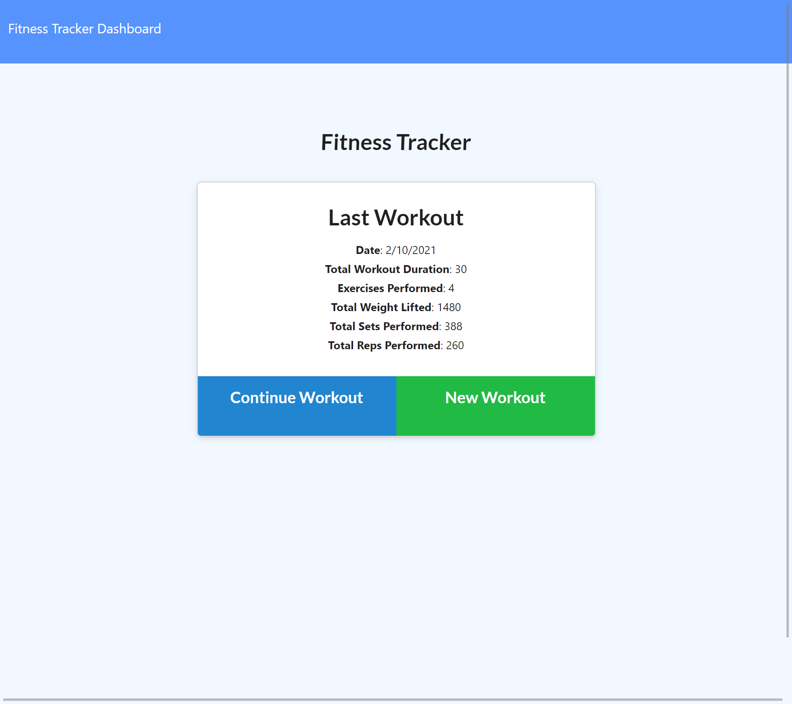

# Workout Tracker
  
## My story
* As someone that works out, I can utitlize this app to keep track of specifics during my workouts
* Understanding the differences in Sequalize and Mongoose
* MongoDB and MySQL are both great databases with advantages and disadvantages of their own
* MonoDB is a great database for smaller projects due to the simplicity of being able to setup collections on the fly 
* MySQL is great for having a structured and compact database so databases can remian manageable
## Features ##
* Enables a User to keep track of Resistance and Cardio type workouts
* Within those workouts Sets, Reps, Duration, and Weight can all be kept track of
* App also allows you to keep track of total duration of your workout
* Displays information in a dynamically updating pie and graph chart
## Installation ##
1. Open up git bash terminal
2. Change directory to desired location (%User Profile%/SourceRepo)
3. Clone the repository (git clone git@github.com:ChristianGoldman/Content-Management-Systems.git)
## Usage ##
1. Open up git bash terminal
2. Change directory to the cloned repo
3. Navigate to the Content-Management-Systems folder
4. In the command line run "npm install"
5. Connect to mongoDB compass 
6. In the command line run "npm run seed" to seed database
7. In the commmand line run "node server.js"
8. Open default browser and enter this line into the address bar "localhost:8080/"
9. Create or view exercises in the database!
10. You should see a webpage similar to this!

## Credits ##
* Cwerness gitlab
* https://umn.bootcampcontent.com/University-of-Minnesota-Boot-Camp/uofm-stp-fsf-pt-09-2020-u-c/blob/master/01-Class-Content/13-MVC/04-Important/MySQLHerokuDeploymentProcess.pdf
* https://expressjs.com/en/guide/routing.html
* Tutor Makism
* BCS learning assistants
* TA's Paul Hendrickson, Tommy Boone, Jake O'Thoole, Daniel Thao
## Link to GitHub
[GitHub](https://github.com/ChristianGoldman/Workout-tracker)
## Link to Heroku App
[Workout Tracker](https://hidden-forest-94005.herokuapp.com/)
## License ##
    MIT License

    Copyright (c) [2020] [Christian Goldman]

    Permission is hereby granted, free of charge, to any person obtaining a copy
    of this software and associated documentation files (the "Software"), to deal
    in the Software without restriction, including without limitation the rights
    to use, copy, modify, merge, publish, distribute, sublicense, and/or sell
    copies of the Software, and to permit persons to whom the Software is
    furnished to do so, subject to the following conditions:

    The above copyright notice and this permission notice shall be included in all
    copies or substantial portions of the Software.

    THE SOFTWARE IS PROVIDED "AS IS", WITHOUT WARRANTY OF ANY KIND, EXPRESS OR
    IMPLIED, INCLUDING BUT NOT LIMITED TO THE WARRANTIES OF MERCHANTABILITY,
    FITNESS FOR A PARTICULAR PURPOSE AND NONINFRINGEMENT. IN NO EVENT SHALL THE
    AUTHORS OR COPYRIGHT HOLDERS BE LIABLE FOR ANY CLAIM, DAMAGES OR OTHER
    LIABILITY, WHETHER IN AN ACTION OF CONTRACT, TORT OR OTHERWISE, ARISING FROM,
    OUT OF OR IN CONNECTION WITH THE SOFTWARE OR THE USE OR OTHER DEALINGS IN THE
    SOFTWARE.